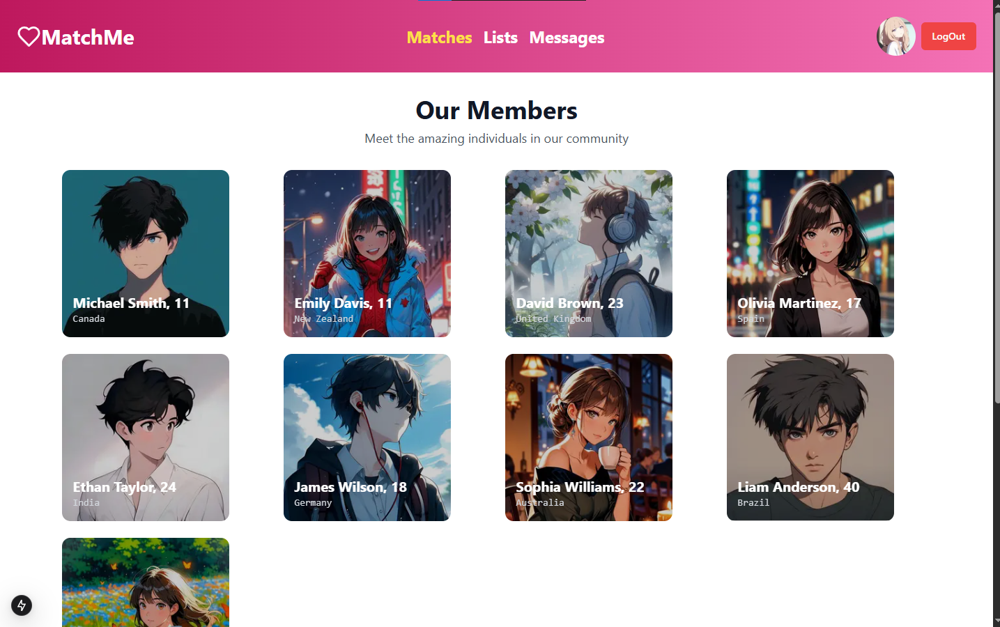

# 💘 Match Me – The Dating Platform

> A modern dating platform where users can create rich profiles, discover potential matches based on shared interests, and connect via real-time chat.

---

## 🌐 Live Demo

🔗 [Match Me Demo](https://youtu.be/5KvjmBqGtZk?si=BGtagXxgJ2Wtomil)  

---

## 💖 Features

- 📝 Profile creation with bio, interests, hobbies & profile picture
- 🔍 Smart match discovery based on shared interests
- 💗 Like profiles and get matched when it’s mutual
- 💬 Real-time chat between matched users (powered by WebSockets)
- 📱 Fully responsive UI with sleek modern design
- 🔒 Secure authentication and user data handling

---

## 🛠️ Tech Stack

**Frontend:** Next.js, Tailwind CSS  
**Backend:** Next.js API Routes, Prisma (PostgreSQL)  
**Real-Time:** WebSockets (`ws`) for live messaging  
**ORM:** Prisma  
**Database:** PostgreSQL  
**Styling:** Tailwind CSS

---